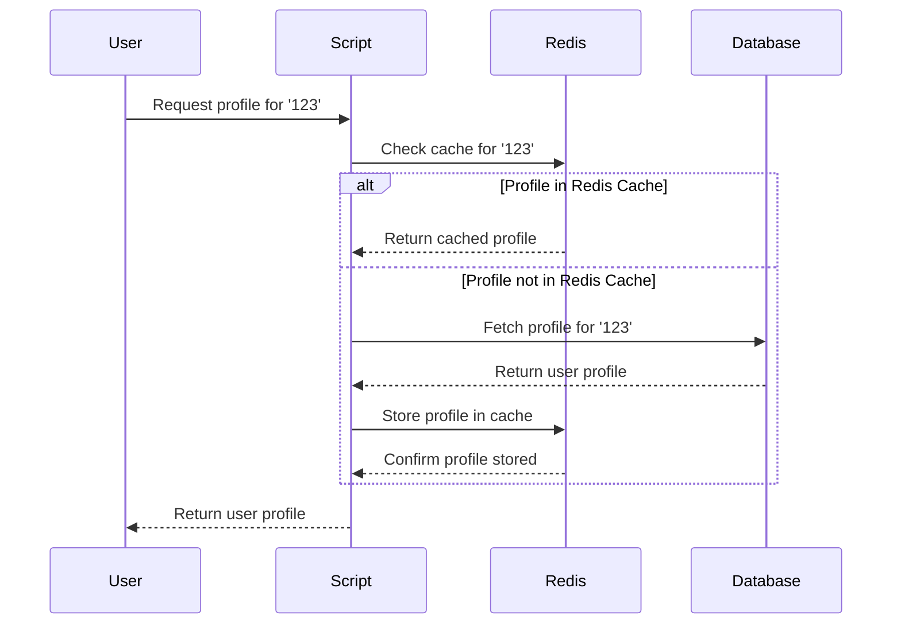

# Hadoop
# Data Aggregation using Apache Hadoop

## Author info

- Author: Teddy Thomas
- GitHub account: littishya21
- UMD email: tedthom1@umd.edu
- Personal email: teddylittishyathomas@gmail.com

## Description

The project, "Data Aggregation with Apache Hadoop using Docker and Python," aims to demonstrate a robust solution for processing and analyzing large-scale datasets efficiently. Leveraging the power of Apache Hadoop, Docker, and Python, we provide a scalable and flexible platform for aggregating and deriving insights from complex data.

The dataset chosen for this project is the "BigMart Sales Data" available on Kaggle, a comprehensive collection of sales data from various BigMart outlets. This dataset offers a real-world scenario, encompassing multiple variables such as product attributes, outlet details, and sales figures, making it ideal for showcasing the capabilities of our solution.

To begin, I utilized Docker to create a containerized environment, ensuring seamless deployment and portability across different systems. Within this Docker container, deployed Apache Hadoop, an open-source framework renowned for its distributed processing capabilities. Apache Hadoop enables parallel processing of data across multiple nodes, facilitating faster analysis and computation of large datasets.

Python serves as the primary programming language for orchestrating data aggregation tasks within the Apache Hadoop ecosystem. Leveraging popular Python libraries such as Hadoop Streaming API, Pandas, and NumPy, we implement data processing pipelines to extract, transform, and aggregate information from the BigMart Sales Data.

The project workflow involves the following key steps:

Data Ingestion: Ingested the BigMart Sales Data into the Hadoop Distributed File System (HDFS), a distributed storage system optimized for handling large volumes of data.
Data Preprocessing: Using Python scripts, preprocessed the raw data to handle missing values, standardize formats, and perform any necessary transformations to prepare it for analysis.
MapReduce Aggregation: Leveraging the MapReduce paradigm, we distribute data processing tasks across multiple nodes in the Hadoop cluster. Map tasks extract relevant information from the dataset, while Reduce tasks aggregate and summarize the extracted data.
Analysis and Insights: After the aggregation process ,analyzed the aggregated data using Python's data analysis tools. Derived valuable insights to understand sales trends, product performance, and other relevant metrics.
Output Generation: Finally, generated output files summarizing the findings of our analysis, providing actionable insights for stakeholders.

## Technologies

### Hadoop: 

--> Hadoop is an open-source framework designed to handle big data processing and storage in distributed computing environments. It provides a scalable, fault-tolerant ecosystem for storing and processing vast amounts of data across clusters of commodity hardware.

--> At its core, Hadoop consists of two primary components: the Hadoop Distributed File System (HDFS) and the MapReduce programming model. HDFS is a distributed file system designed to store large datasets reliably across multiple machines. It divides files into blocks and replicates them across different nodes in the cluster to ensure fault tolerance and data availability.

--> The MapReduce programming model is a parallel processing paradigm for distributed data processing. It divides computational tasks into two phases: the Map phase and the Reduce phase. During the Map phase, input data is processed in parallel across multiple nodes in the cluster, generating intermediate key-value pairs. These intermediate results are then aggregated and processed further during the Reduce phase to produce the final output.

-->Hadoop also includes a variety of other components and modules that extend its functionality, such as:

  - YARN (Yet Another Resource Negotiator): YARN is a resource management layer that enables efficient resource allocation and job scheduling in Hadoop clusters. It allows multiple processing frameworks, such as MapReduce, Apache Spark, and Apache Flink, to run concurrently on the same cluster.
  - Hadoop Common: Hadoop Common provides the essential libraries and utilities required by other Hadoop modules. It includes tools for managing Hadoop clusters, interacting with HDFS, and performing administrative tasks.
  - Hadoop Ecosystem Projects: The Hadoop ecosystem consists of a vast array of projects and tools that integrate with Hadoop to extend its capabilities. These include Apache Hive for data warehousing, Apache Pig for data processing, Apache HBase for real-time NoSQL databases, and Apache Spark for in-memory data processing, among others.
### Docker: Containerization for Portability

- Docker is a containerization platform that simplifies the process of
  developing, deploying, and running applications
- It allows developers to package an application and its dependencies into a
  lightweight, portable container
- These containers can run consistently across different environments, ensuring
  that the application behaves the same way in development, testing, and
  production
- Docker provides a standardized way to encapsulate and distribute applications,
  making it easier to manage dependencies, streamline deployment, and enhance
  collaboration among development teams.

- The Dockerfile specifies the use of an official Python runtime as the base
  image, installs the Redis server, and copies the Python script and mock
  database file into the container. The resulting Docker image encapsulates the
  entire project, making it easily deployable and scalable.

- By using Docker, the project achieves portability and encapsulation, allowing
  developers to run the application in any environment with minimal setup.

## Docker implementation

- The Docker system designed for this project follows a logical sequence to
  ensure a smooth and consistent environment for both development and deployment

- Let's delve into the intricacies of the Docker system logic:

- Project Setup:
  - Begin with organizing your project files within a directory structure. The
    main files include:
    - `Redis_cache_to_fetch_user_profile.ipynb`: Contains the Jupyter Notebook
      code for fetching user profiles with Redis caching.
    - `Dockerfile`: Includes instructions for building a Docker image for the
      project.
    - `Docker-compose.yaml`: Defines services, networks, and volumes for Docker
      containers.

- Dockerfile Configuration:
  - Start by setting up the Dockerfile with the following steps:
    - Utilize an official Python runtime as the base image `python:3.8-slim`
    - Set the working directory in the container to `/app`.
    - Copy the project files into the container.
    - Install necessary dependencies (redis and notebook) using pip.
    - `Expose port 8888` for the Jupyter Notebook server.
    - Specify the default command to run the Jupyter Notebook server.

- Docker-compose.yaml Configuration:
  - Configure the docker-compose.yaml file to define the services required for
    the project:
    - Define two services: redis and notebook.
    - Configure the redis service:
      - Use the official redis:latest image.
      - Map `port 6378` on the host to `port 6379` in the container.
      - Set the container name as redis-server.
    - Configure the notebook service:
      - Use the custom Docker image built from the Dockerfile.
      - Map `port 8888` on the host to `port 8888` in the container.
      - Set the `REDIS_HOST` environment variable to redis.
      - Make it dependent on the redis service.
      - Specify the container name as `notebook-server`.
      - Mount the project directory into the container at `/app`.

- Building the Docker Image:
  - Execute `docker build -t <your_image_name> .` to build the Docker image
    using the Dockerfile.
  - Replace `<your_image_name>` with a suitable name for the Docker image.

- Running the Docker Containers:
  - Start the Docker containers with `docker-compose up`.
  - Docker Compose will create and launch containers for the redis and notebook
    services.
  - Access the Jupyter Notebook server at `http://localhost:8888` in a web
    browser.

- Accessing the Jupyter Notebook Server:
  - Navigate to `http://localhost:8888` in a web browser to access the Jupyter
    Notebook interface.
  - Interact with your notebook file (Redis_cache_to_fetch_user_profile.ipynb)
    to execute code for fetching user profiles using Redis caching.

- Stopping the Docker Containers:
  - To stop containers, press `Ctrl + C` in the terminal running
    `docker-compose up`.
  - Alternatively, use `docker-compose down` to stop and remove containers.

## 3. Python Script Overview

The Redis Cache to Fetch User Profiles script demonstrates an efficient approach
to user profile caching using Redis. The script is structured to fetch user
profiles from a mock database, implement caching with Redis, and showcase the
seamless integration of Docker for containerization.

The script is primarily divided into three sections:

- Set up Redis Connection: The script begins by establishing a connection to a
  Redis server to enable caching of user profiles.The `REDIS_HOST` environment
  variable is utilized to dynamically specify the host address of the Redis
  server.

- Mock Database: The json data is saved in a variable in the script. User can
  also include an externl json file.

- Fetch User Profile Function:
  - Implements the `fetch_user_profile` function to read the mock database file
    and retrieve a user's profile based on their ID.
  - Implements the `get_user_profile` function to check if the user's profile is
    in the Redis cache, fetches it if present, or retrieves it from the mock
    database, stores it in the cache, and returns the profile.

- Example Usage: Provides an example usage at the end of the script,
  demonstrating how to fetch a user's profile using the caching mechanism.

- Example Output: Let's walk through the script's functionality with an example:
  ```
  user_id_to_fetch = '123'
  user_profile = get_user_profile(user_id_to_fetch)
  print(f"Fetched user profile: {user_profile}")
  ```

- Output Explanation:
  - If the user profile is in the Redis cache:
    ```
    User profile for 123 found in Redis cache.
    Fetched user profile: {'user_id': '123', 'name': 'Shaunak Dhande', 'email': 'shaunakdhande4000@gmail.com', 'age': 22}
    ```
  - If the user profile is not in the Redis cache:
    ```
    User profile for 123 not found in cache. Fetched from the database and stored in Redis.
    Fetched user profile: {'user_id': '123', 'name': 'Shaunak Dhande', 'email': 'shaunakdhande4000@gmail.com', 'age': 22}
    ```

## 4. Mock Database Schema

The mock database follows a simple JSON structure where each user profile is
represented as a dictionary. The schema includes the user's ID, name, email, and
age.
```
{
  "123": {
    "user_id": "123",
    "name": "Shaunak Dhande",
    "email": "shaunakdhande4000@gmail.com",
    "age": 22
  },
  "456": {
    "user_id": "456",
    "name": "Alice Johnson",
    "email": "alice.johnson@example.com",
    "age": 30
  },
  // Additional profiles...
}
```

## 5. Project Diagram



## 6. Conclusion

The Redis Cache to Fetch User Profiles project establishes an effective synergy
between Redis caching, Python scripting, and Docker containerization. By
prioritizing efficient user profile retrieval, the project showcases the power
of Redis in optimizing data access, minimizing database load, and enhancing
overall system responsiveness. The seamless integration of Docker ensures a
consistent and portable environment, simplifying deployment across various
platforms. With its clear logical structure, illustrated diagrams, and practical
example usage, the project serves as a valuable resource for developers looking
to implement robust caching mechanisms in their applications. While achieving
its primary goals, the project also opens avenues for future enhancements,
encouraging exploration of advanced Redis features and scalability
considerations.
